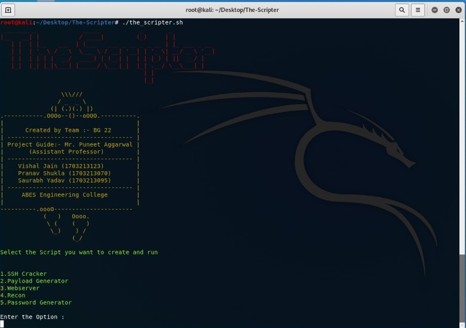
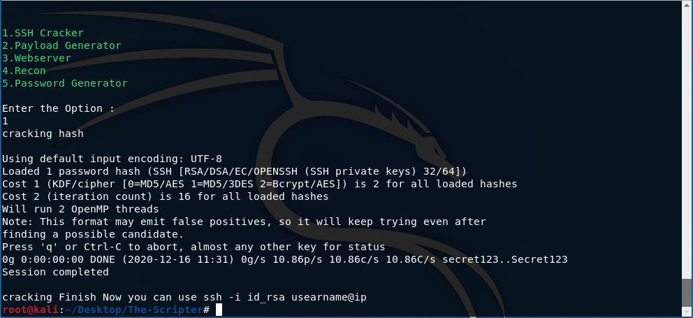
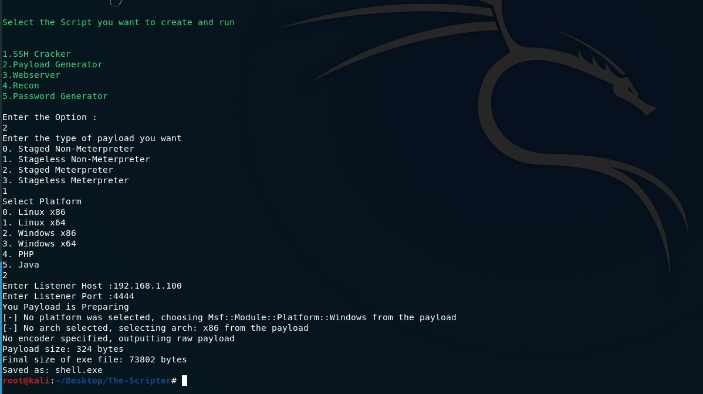
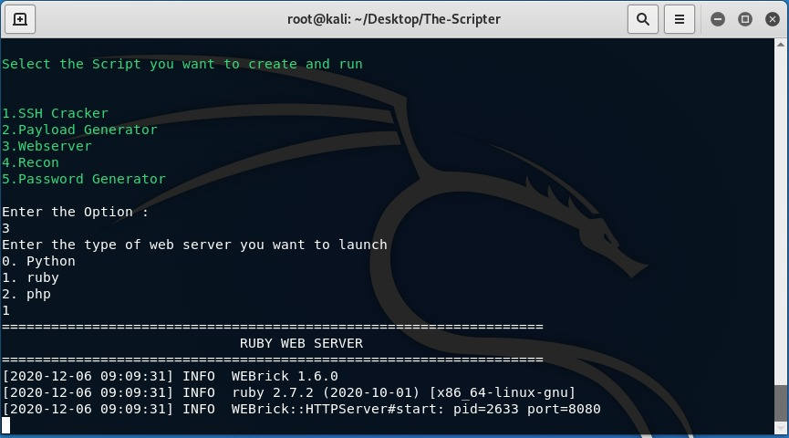
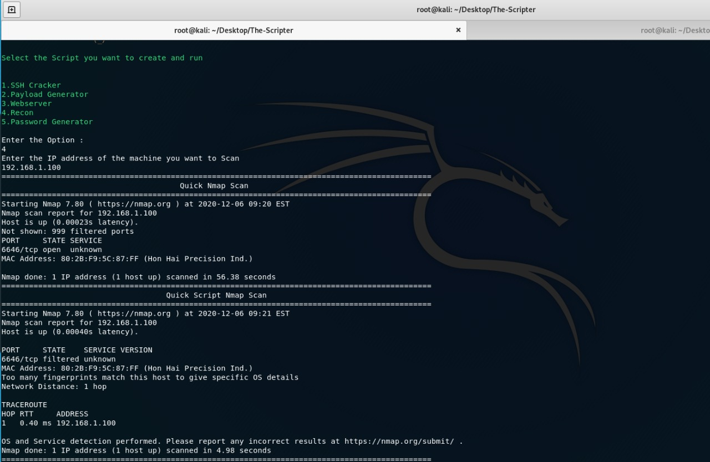
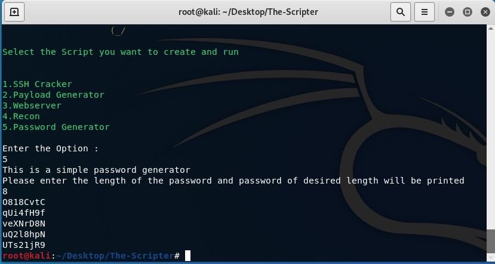

# The_Scripter

The Scripter is a beginner Friendly tool that is made by hackers and made for hackers. This
tool was created to make hackers’ life easy. This tool has the main script that will manage
all other scripts. This tool will be designed in such a way so that hackers will find it
interesting and easy to work with and most importantly hacker can use these individual scripts 
without running through main script also and they can also modify scripts according to comfortability
if they are at some intermediate level.
 
 
## INSTALLATION PROCESS
  
**Step 1:**     Clone the Script from the given Github Repository
**Command:**    git clone https://github.com/THE-NOS44/The-Scripter

**Step 2:**     cd to the scripter Directory
**Command:**    cd The_Scripter/

**Step 3:**     Permit the script  to run using the chmod command 
**Command:**    chmod +x  install.sh

**Step 4:**     Run install.sh  file as a sudo user
**Command :**   sudo  ./install.sh

**Step 5:**     Now run the_scripter.sh file
**Command :**   ./the_scripter.sh

Now you will get command line option to select which script you want to run.

**Lets know what these scripts are doing one by one**

## 1. SSH Cracker
This script will contain code for cracking id_rsa key using John The Ripper.
It will make id_rsa executable and crack it’s password . It will also detect id_rsa is openkey or private key .
This script will also have option for bruteforcing ssh username.

## 2. Payload Generator
The Payload Generator script will help to generate different types of payloads according to you.
This Script will give options to select the type of payload and the platform for which you needed the payload.

## 3. Webserver
Webserver script will create a web server of your choice for file transferring
and hosting of files. The script uses three different programming languages library to
create a webserver.
1. Python
2. Ruby
3. PHP

## 4. Recon
Recon is a simple script that will scan the whole machine stepwise  Like first it will quickly
give results and then will perform a script scan and also start the full scan in the background.

## 5. Password Generator
Password Generator is a password generation tool that will print the password of the
desired length you just need to enter the length of the password and 4 passwords will be
printed and you can choose the password which you like the most.

